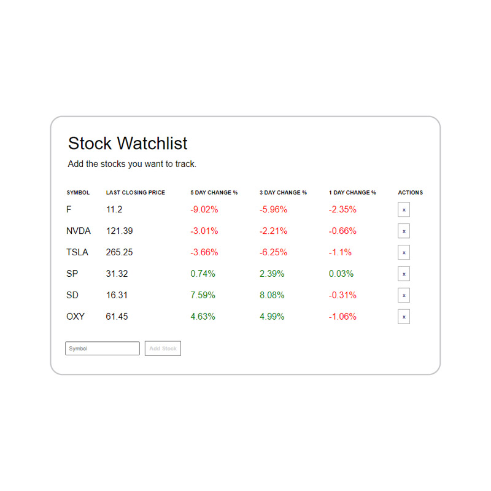

# Stock Watchlist
Add the stock symbols that you're tracking to the watchlist and compare price movements. The list pulls market data for each stock and calculates 5-day, 3-day, and 1-day price changes to help identify trends.

{width=400}

### Deployed at [stockwatchlist.vercel.app](stockwatchlist.vercel.app)

Built with Vanilla JS, HTML & CSS.
